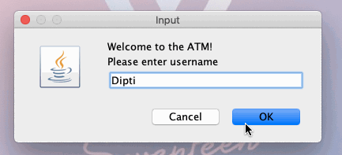

# ATM_Project
Java program that simulates ATM user actions (deposit/withdrawal)

# ATM_Project

**ATM** is a simple program that mimics an ATM, with a log-in process and ability to withdrawal/deposit funds

Time spent: **4** hours spent in total

## Video Walkthrough

Here's a walkthrough of implemented user stories:

GIF created with [LiceCap](http://www.cockos.com/licecap/).

## Notes
Tutorial provided by [Edureka!](https://www.youtube.com/watch?v=WsUuqlTgBK0&t=364s&ab_channel=edureka%21)
